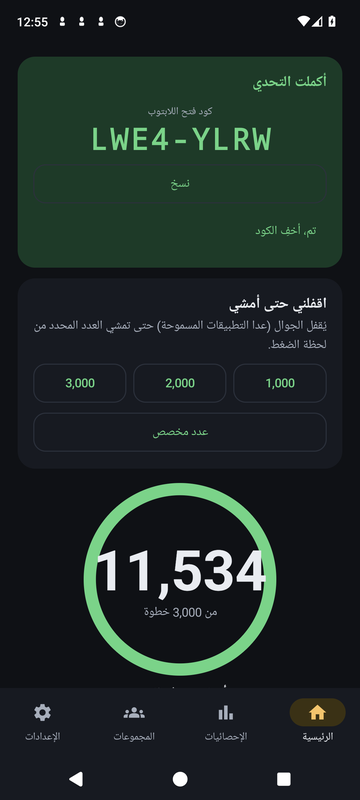
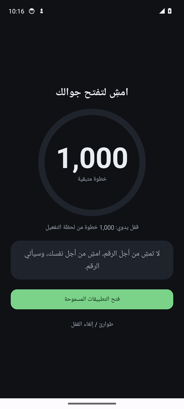
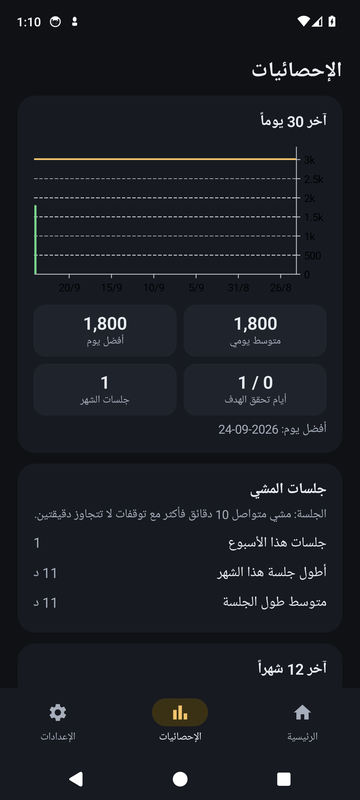
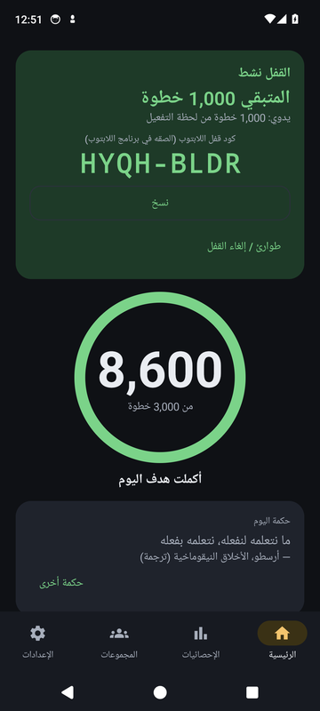
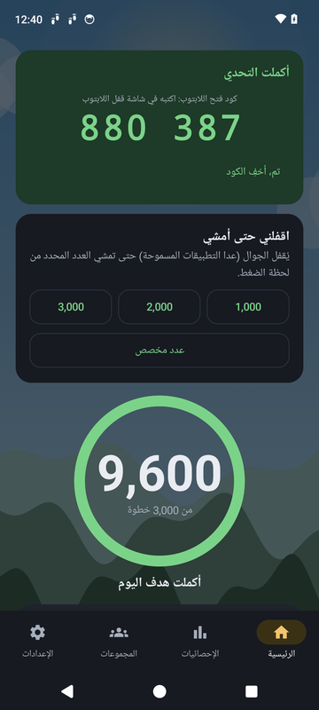

# khatwa (خطوة)

  
  &nbsp;
  
  &nbsp;
  

**English:** a free Android app (Arabic and English) that counts your steps and can lock your phone, and your Windows laptop, until you walk. Download both from **[Releases](https://github.com/Ahmad-Nayfeh/khatwa/releases/latest)**.

## ما هو «خطوة»؟

تطبيق مجاني يعدّ خطواتك كل يوم، ويقفل جوالك (ولابتوبك إن أردت) حتى تمشي عدداً محدداً من الخطوات. يعمل بلا إنترنت، ولا يرسل أي بيانات، ولا يحتاج حساباً.

## التحميل

من صفحة **[Releases](https://github.com/Ahmad-Nayfeh/khatwa/releases/latest)**:

| الملف | لأي جهاز |
|---|---|
| `khatwa-….apk` | الجوال (أندرويد) |
| `khatwa-laptop-lock-….exe` | اللابتوب (ويندوز 10/11)، اختياري |

## تثبيت الجوال

1. نزّل ملف الـ APK على الجوال وافتحه. إن طُلب «السماح بالتثبيت من هذا المصدر» فاسمح به.
2. إن حجبه **Play Protect** اختر «التثبيت على أي حال».
3. افتح التطبيق واتبع شاشات الترحيب؛ تشرح كل صلاحية قبل طلبها.
4. ليعمل القفل فعّل **خدمة الإتاحة** و**العرض فوق التطبيقات**. على أندرويد 13 فأعلى إن ظهر «إعداد مقيّد»: إعدادات الجوال ← التطبيقات ← خطوة ← النقاط الثلاث ← «السماح بالإعدادات المقيّدة».
5. على سامسونج: إعدادات التطبيق ← البطارية ← **غير مقيّد**، حتى لا يتوقف العدّ.

## الاستخدام

- **الرئيسية:** خطوات اليوم والهدف، وأزرار القفل (1000 / 2000 / 3000 خطوة). يُفتح الجوال تلقائياً عندما تمشيها.
- **الإحصائيات:** اسحب شريط الأيام يميناً ويساراً لترى كل يوم، وتحته المخططات.
- **الإعدادات:** الهدف، القفل المجدول اليومي، التطبيقات المسموحة أثناء القفل، اللغة، والمظهر.
- **الحساب:** أول شاشة عند فتح التطبيق (ويمكن التخطي)، أو لاحقاً من الإعدادات ← الحساب. بلا حساب تبقى بياناتك على الجوال فقط، ونقلها مسؤوليتك عبر الإعدادات ← النسخة الاحتياطية. سجّل ببريدك وكلمة مرور فتُحفظ نسخة خاصة من بياناتك في حسابك تلقائياً كل يوم (لا يراها غيرك). إن حذفت التطبيق أو غيّرت جوالك، سجّل الدخول فتعود بياناتك.
- **الطوارئ:** زر في شاشة القفل: انتظار دقيقة ثم كتابة جملة، ويُسجَّل «استسلاماً».

## قفل اللابتوب (اختياري)

  
  &nbsp;
  

1. **مرة واحدة:** في الجوال: الإعدادات ← قفل اللابتوب ← «توليد كود الاقتران» (8 أرقام). شغّل برنامج اللابتوب واكتب الأرقام.
2. **للقفل:** اقفل جوالك، فيظهر في الرئيسية كود من 6 أرقام. اكتبه في برنامج اللابتوب فيُقفل فوراً.
3. **للفتح:** عندما تكمل المشي يظهر كود فتح من 6 أرقام. اكتبه في شاشة قفل اللابتوب فيُفتح.

لا شبكة ولا بلوتوث. إن ظهر تحذير Windows SmartScreen عند أول تشغيل: «مزيد من المعلومات» ← «التشغيل على أي حال».

## المجموعات (اختياري)

من تبويب **المجموعات** (بنفس الحساب): أنشئ مجموعة وشارك كود الدعوة مع أصدقائك، وتنافسوا على الخطوات. الميزة مطفأة حتى تفعّلها، وعندها تُرسل اسمك المستعار وأرقام خطواتك فقط؛ بريدك للدخول فقط ولا يراه أحد من الأعضاء. نسيت كلمة المرور؟ زر «نسيت كلمة المرور؟» يرسل رابطاً إلى بريدك.

## أسئلة سريعة

- **القفل لا يعمل؟** افتح التطبيق واضغط زر تنبيه «القفل لا يعمل»، أو راجع الإعدادات ← حالة الصلاحيات.
- **الخطوات لا تُعدّ؟** الجوال يجب أن يكون معك أثناء المشي. راجع الإعدادات ← حالة الصلاحيات، وقيود البطارية على سامسونج.
- **اللابتوب يرفض الكود؟** اكتب الكود الظاهر الآن في الرئيسية (لكل قفل كود جديد). إن أعدت توليد كود الاقتران فأعد الاقتران في اللابتوب.
- **نقلت إلى جوال جديد؟** الإعدادات ← النسخة الاحتياطية ← تصدير، ثم استيراد في الجوال الجديد.

---

مفتوح المصدر برخصة MIT. للمطوّرين: [docs/DEVELOPERS.md](docs/DEVELOPERS.md).

