# khatwa (خطوة)

  

  
  &nbsp;&nbsp;
  
  &nbsp;&nbsp;
  

**English summary.** khatwa is a free, open-source (MIT) Android app, in Arabic and English, that counts your daily steps from the phone's built-in step sensor, shows clean statistics and a sourced daily quote, and can lock the phone (except apps you allow) until you walk a set number of steps, on demand or on a daily schedule. A small Windows companion (`laptop-lock/`) locks your laptop too: pair it once with the phone, paste the *lock code* the phone shows when you start a walking challenge, and paste the *unlock code* it shows when the challenge is done. Both codes are derived offline from a shared secret, no network involved. An optional **Groups** tab (Firebase, off by default) lets friends compete on steps with anonymous identities and invite codes. Everything else works without internet; nothing leaves the phone unless you enable groups. Downloads (APK and Windows exe) are on the **Releases** page. The rest of this README is in Arabic and written for non-technical users.

---

## ما هو «خطوة»؟

تطبيق أندرويد مجاني ومفتوح المصدر (بالعربية والإنجليزية) يعدّ خطواتك كل يوم من حساس الجوال مباشرة، ويعرض إحصائيات نظيفة وحكمة يومية موثّقة المصدر، ويستطيع قفل الجوال (ما عدا التطبيقات التي تسمح بها) حتى تمشي عدداً محدداً من الخطوات. ومعه برنامج صغير لويندوز يقفل اللابتوب بنفس التحدي: تقفل الجوال، تلصق «كود القفل» في اللابتوب فيُقفل، وعند إكمال التحدي تلصق «كود الفتح» فيُفتح. وفيه تبويب اختياري للمجموعات والتنافس مع الأصدقاء.

**ما الذي لا يفعله:**

- لا يحتاج إنترنت (إلا ميزة المجموعات إن فعّلتها بنفسك). لا حساب، لا تسجيل، لا إعلانات، لا Google Fit ولا Health Connect ولا Samsung Health.
- لا يرسل أي بيانات إلى أي مكان. الاستثناء الوحيد ميزة «المجموعات والتنافس»: مطفأة افتراضياً، وعند تفعيلها تُرسل اسماً مستعاراً وأرقام خطواتك فقط (الفقرة 3).
- لا يحسب سعرات ولا مسافات ولا مؤشر كتلة الجسم. الوزن سجلٌ يدوي واتجاه فقط.
- القفل ليس مستحيل الكسر، ولا يريد أن يكون. فيه مخرج طوارئ مقصود (انتظار دقيقة وكتابة جملة طويلة)، وكل استخدام له يُسجَّل باسم «استسلام».

**افتراض مهم:** الحساس يعدّ حركة الجوال نفسه. الجوال يجب أن يكون معك أثناء المشي.

## ابدأ في خمس خطوات

1. نزّل ملف التطبيق (APK) من صفحة **Releases** وثبّته (الفقرتان 1.1 و1.2).
2. افتح التطبيق واتبع شاشة الترحيب: تشرح كل صلاحية قبل طلبها (1.3).
3. فعّل «خدمة الإتاحة» و«العرض فوق التطبيقات» حتى يعمل القفل (1.4 و1.5). بدونهما يعدّ التطبيق خطواتك لكنه لا يستطيع قفل الجوال.
4. على سامسونج: استثنِ التطبيق من قيود البطارية حتى لا يتوقف العدّ (1.6).
5. امشِ. عندما تريد قفل الجوال اضغط 1000 أو 2000 أو 3000 في الرئيسية، أو فعّل القفل المجدول من الإعدادات. ولقفل اللابتوب معه انظر الفقرة 2.

---

## 1. الجوال: التثبيت والإعداد

### 1.1 تحميل الـ APK

1. افتح صفحة **Releases** في هذا المستودع: `https://github.com/Ahmad-Nayfeh/khatwa/releases` (لا تحتاج حساب GitHub).
2. في أحدث إصدار، اضغط على الملف `khatwa-<الإصدار>.apk` لتنزيله على الجوال.

### 1.2 التثبيت من خارج المتجر

1. افتح الملف من شريط الإشعارات أو من تطبيق «ملفاتي».
2. إن ظهرت رسالة «لا يُسمح بتثبيت تطبيقات غير معروفة من هذا المصدر»: اضغط «الإعدادات» وفعّل «السماح من هذا المصدر» للمتصفح أو مدير الملفات، ثم عد.
3. **Play Protect** قد يحجب التطبيق لأنه يطلب «خدمة الإتاحة» و«العرض فوق التطبيقات» (وهذا طبيعي لتطبيق يقفل الجوال). الحل المعروف: إيقاف الفحص مؤقتاً أثناء التثبيت:
   - افتح **Google Play** ← صورة الحساب ← **Play Protect** ← الترس ⚙ ← أوقف «فحص التطبيقات باستخدام Play Protect».
   - ثبّت التطبيق.
   - **أعد تفعيل** الفحص بعد التثبيت. إن طلب Play Protect لاحقاً حذف التطبيق، اختر «الإبقاء».
4. **سامسونج، Auto Blocker:** إن ظهرت رسالة عن Auto Blocker: الإعدادات ← الأمان والخصوصية ← **Auto Blocker** ← أوقفه مؤقتاً، ثبّت وفعّل الصلاحيات، ثم أعده إن أردت.

### 1.3 شاشة الترحيب (تشرح كل خطوة داخل التطبيق)

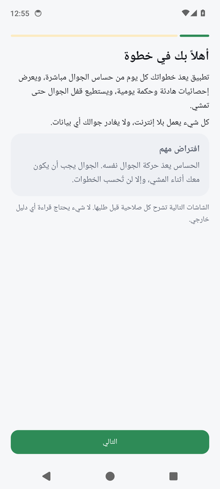

عند أول فتح تمر بسبع شاشات قصيرة:

1. **الترحيب** وما يفعله التطبيق.
2. **صلاحية النشاط البدني** لقراءة عدّاد الخطوات. اضغط «منح الصلاحية».
3. **الإشعارات**: إشعار ثابت صامت يعرض خطوات اليوم حتى يبقى العدّ يعمل في الخلفية.
4. **الهدف**: الهدف المؤقت لأسبوع القياس (افتراضي 3000)، الهدف النهائي (8000)، الزيادة الأسبوعية (500).
5. **قفل الجوال (اختياري الآن)**: خدمة الإتاحة والعرض فوق التطبيقات (انظر 1.4 و1.5).
6. **البطارية**: استثناء التطبيق من تحسين البطارية.
7. **جاهز**.

### 1.4 فتح «الإعدادات المقيّدة» على أندرويد 13 فأعلى

لأن التطبيق من خارج المتجر، قد يرفض النظام تفعيل خدمة الإتاحة ويعرض «إعداد مقيّد». الحل:

1. الإعدادات ← التطبيقات ← **خطوة**.
2. اضغط النقاط الثلاث أعلى الشاشة ← **«السماح بالإعدادات المقيّدة»** وأكّد.
3. عد إلى الإعدادات ← الإتاحة (إمكانية الوصول) ← التطبيقات المثبتة ← **خطوة** ← فعّل.

هذه الخطوات موجودة أيضاً داخل التطبيق في: الإعدادات ← حالة الصلاحيات.

### 1.5 تفعيل خدمة الإتاحة وصلاحية العرض فوق التطبيقات

- **خدمة الإتاحة**: تُستخدم فقط لمعرفة اسم التطبيق المفتوح حالياً حتى تُعرض شاشة القفل فوقه. لا تقرأ محتوى الشاشة ولا ما تكتبه (خيار قراءة المحتوى مطفأ في تعريف الخدمة نفسها).
- **العرض فوق التطبيقات**: لتظهر شاشة القفل فوق التطبيق غير المسموح.

إن كانت إحداهما غير مفعّلة، تعرض الشاشة الرئيسية تنبيهاً دائماً «القفل لا يعمل» مع زر يفتح الإعداد المناسب، وتبقى أزرار القفل معطّلة حتى تُصلحها. يُفحص ذلك عند كل فتح للتطبيق. شاشة «حالة الصلاحيات» في الإعدادات تجمع كل الصلاحيات في مكان واحد مع زر لكل واحدة.

<table align="center">
  <tr>
    <td align="center">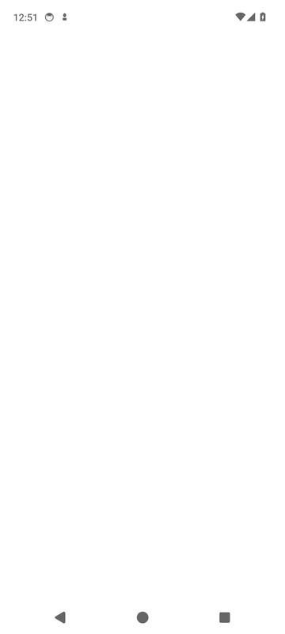 تنبيه «القفل لا يعمل» عندما تكون خدمة الإتاحة مطفأة</td>
    <td align="center">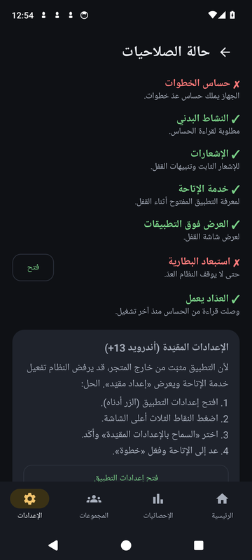 الإعدادات ← حالة الصلاحيات</td>
  </tr>
</table>

### 1.6 البطارية على سامسونج

حتى لا يوقف النظام العدّ في الخلفية:

1. الإعدادات ← التطبيقات ← خطوة ← البطارية ← **غير مقيّد**.
2. الإعدادات ← العناية بالجهاز ← البطارية ← حدود استخدام الخلفية ← **التطبيقات غير الخاضعة للسكون** ← أضف «خطوة».

### 1.7 كيف يعمل التطبيق يومياً

**الرئيسية.** رقم اليوم مع حلقة التقدّم، حكمة اليوم مع مصدرها (وزر «حكمة أخرى»؛ يمكن إخفاء البطاقة من الإعدادات)، أعمدة الأسبوع مع خط الهدف، جلسات هذا الأسبوع، مقارنة بالأسبوع الماضي (نفس الأيام المنقضية، والأسبوع يبدأ الأحد لأن الجمعة والسبت عطلة)، السلسلة الحالية وأطول سلسلة، أزرار «اقفلني حتى أمشي»، وأثناء القفل بطاقة «كود قفل اللابتوب» (الفقرة 2).

**الإحصائيات.** في الأعلى **شريط الأيام**: اسحبه يميناً ويساراً؛ اليوم في المنتصف يظهر كبيراً مع خطواته وحلقة هدفه، واليوم الذي بعده عن يمينه واليوم الذي قبله عن يساره بشكل ضبابي، والضغط على أيهما ينقله إلى المنتصف. تحته تفاصيل اليوم المختار (نسبة الهدف، الجلسات، أطول جلسة)، ثم السلاسل والمتوسط وأفضل يوم، ثم آخر 30 يوماً، جلسات المشي (الجلسة = مشي متواصل 10 دقائق فأكثر مع توقفات لا تتجاوز دقيقتين)، آخر 12 شهراً مع خط الوزن، توزيع المشي على ساعات اليوم، والاستسلامات هذا الشهر.

<table align="center">
  <tr>
    <td align="center"> الرئيسية بعد اكتمال هدف اليوم</td>
    <td align="center"> الإحصائيات: شريط الأيام</td>
    <td align="center">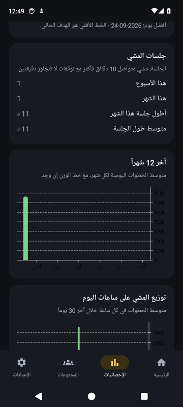 الإحصائيات: المخططات</td>
  </tr>
</table>

**الهدف التدريجي.** أول 7 أيام أسبوع قياس بالهدف المؤقت. بعدها الهدف = متوسط أسبوع القياس + الزيادة (ولا يقل عن الهدف المؤقت)، ثم يرتفع بالزيادة كل أسبوع حتى الهدف النهائي. إن فشلت أكثر من 4 أيام في أسبوع يثبت الهدف في الأسبوع التالي. لا يهبط تلقائياً أبداً. من الإعدادات ← الهدف يمكنك «التعديل اليدوي» لإيقاف التدرّج.

**القفل اليدوي.** زر 1000 / 2000 / 3000 / مخصص. يُقفل الجوال (عدا المسموح) حتى تمشي العدد من لحظة الضغط، ثم يُفتح تلقائياً مع إشعار هادئ «أحسنت». التطبيقات المسموحة تعمل بشكل طبيعي أثناء القفل.

<table align="center">
  <tr>
    <td align="center">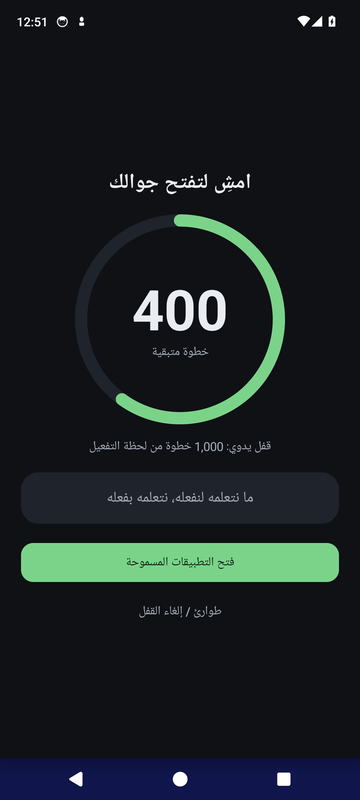 شاشة القفل: كم بقي من الخطوات</td>
    <td align="center"> تطبيق غير مسموح: تظهر شاشة القفل فوقه</td>
    <td align="center">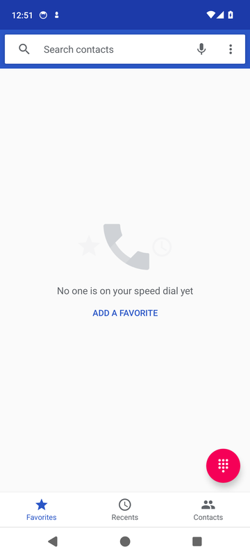 تطبيق مسموح (الهاتف): يعمل بلا قفل</td>
  </tr>
</table>

**القفل المجدول.** من الإعدادات ← القفل المجدول. عند وقت البدء (افتراضي 8:00 م)، إن لم تكمل الهدف الفعلي يُفعَّل القفل حتى تكمله أو حتى وقت الانتهاء (11:00 م). تنبيه هادئ قبله بـ 30 دقيقة. اختر أيام الأسبوع.

**قائمة المسموح.** افتراضياً الهاتف وجهات الاتصال والرسائل ويوتيوب. مسموح دائماً ولا يمكن حظره: المكالمات، الطوارئ، واجهة النظام، المشغّل، لوحة المفاتيح، وهذا التطبيق. خيار «حظر تطبيق الإعدادات أثناء القفل» مفعّل افتراضياً.

**الطوارئ.** زر «طوارئ / إلغاء القفل» في شاشة القفل (وفي الرئيسية أثناء القفل): انتظار 60 ثانية، ثم كتابة جملة طويلة حرفياً (بالعربية «أختار الاستسلام اليوم وأعلم أن هذا يُسجَّل»، وبالإنجليزية جملة مكافئة عندما تكون لغة التطبيق إنجليزية)، ثم تأكيد. يُسجَّل استسلاماً بالتاريخ والخطوات المتبقية.

<table align="center">
  <tr>
    <td align="center">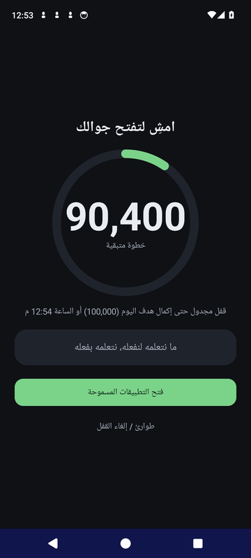 القفل المجدول عندما يحين وقته</td>
    <td align="center"> الطوارئ: انتظار دقيقة ثم الجملة</td>
  </tr>
</table>

**الإعدادات.** الهدف، القفل المجدول، قائمة المسموح، قفل اللابتوب (الاقتران)، سجل الوزن، الحكم (تعديل وتصدير واستيراد)، النسخة الاحتياطية، حالة الصلاحيات، ثم بطاقة «الإشعارات والمظهر».

**اللغة والمظهر.** من الإعدادات ← الإشعارات والمظهر: اللغة **العربية** أو **English** (تتغير كل الشاشات والإشعارات واتجاه الواجهة والمخططات فوراً، وتُختار الحكم بلغة التطبيق)، والمظهر «تلقائي» (يتبع وضع الجهاز) أو «فاتح» أو «داكن».

<table align="center">
  <tr>
    <td align="center">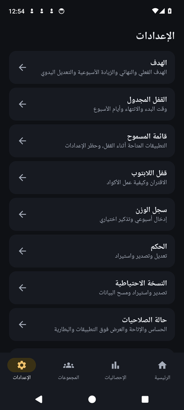 الإعدادات</td>
    <td align="center">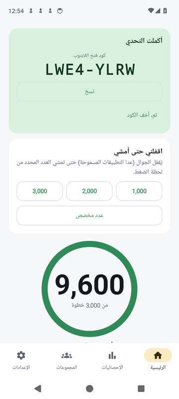 الرئيسية بالمظهر الفاتح</td>
    <td align="center">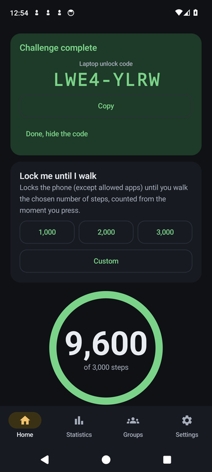 الرئيسية بالإنجليزية</td>
  </tr>
</table>

**الحكم.** مجموعة موثّقة المصدر: أبيات ومقولات عربية (الشافعي، المتنبي، الشابي، ابن الوردي، أبو ماضي، شوقي، جبران، ابن خلدون وغيرهم) ومقولات إنجليزية من فلاسفة وكتّاب معروفين، كل واحدة منسوبة إلى قائلها. لا أحاديث ولا نصوص من تأليف أحد. يمكنك تعديل القائمة أو إضافة حكمك أو استعادة القائمة الأصلية من الإعدادات ← الحكم.

<table align="center">
  <tr>
    <td align="center"> الحكم: عدّل أو أضف أو استورد</td>
    <td align="center">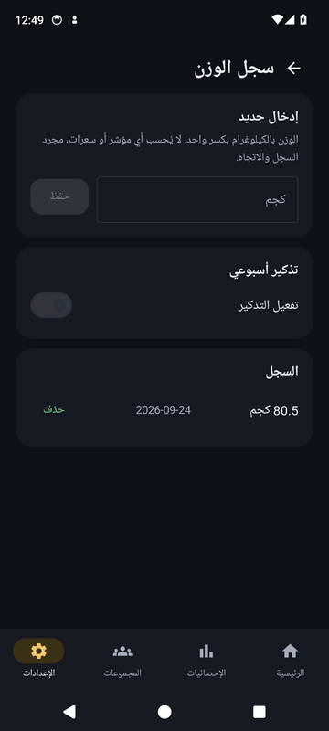 سجل الوزن الأسبوعي</td>
  </tr>
</table>

### 1.8 النسخة الاحتياطية

الإعدادات ← النسخة الاحتياطية ← **تصدير نسخة كاملة**: ملف JSON واحد يشمل الخطوات والجلسات واللقطات والوزن والاستسلامات والحكم وكل الإعدادات (بما فيها كود اقتران اللابتوب واسمك المستعار في المجموعات). احفظه في مكان آمن (مثلاً Google Drive الخاص بك). **الاستيراد** يستبدل كل البيانات الحالية. **مسح كل البيانات** يعيد التطبيق إلى شاشة الترحيب.

---

## 2. اللابتوب (ويندوز 10/11)

### 2.1 المبدأ

لا شبكة ولا بلوتوث ولا حساب. الجوال واللابتوب يتشاركان **كود اقتران** واحداً (16 حرفاً) تدخله في اللابتوب مرة واحدة. بعدها لكل تحدي مشي كودان يحسبهما الجهازان بنفس الطريقة:

- **كود قفل اللابتوب** (8 أحرف): يظهر في الرئيسية لحظة قفل الجوال. تلصقه في برنامج اللابتوب فيُقفل اللابتوب. الكود الخاطئ يُرفض.
- **كود فتح اللابتوب** (8 أحرف): يظهر في الرئيسية عندما ينتهي التحدي (أكملت الخطوات أو استسلمت). تلصقه في شاشة قفل اللابتوب فيُفتح.

<table align="center">
  <tr>
    <td align="center"> عند القفل: كود قفل اللابتوب</td>
    <td align="center"> عند إكمال التحدي: كود الفتح</td>
    <td align="center"> الإعدادات ← قفل اللابتوب: الاقتران</td>
  </tr>
</table>

### 2.2 التحميل وتحذير SmartScreen

1. من صفحة **Releases** نزّل `khatwa-laptop-lock-<الإصدار>.exe` (ملف واحد، لا تثبيت). ضعه في أي مجلد، مثلاً `C:\khatwa`.
2. عند أول تشغيل قد يظهر **Windows SmartScreen**: «منع Windows تشغيل تطبيق غير معروف». اضغط **«مزيد من المعلومات»** ثم **«التشغيل على أي حال»**. السبب أن الملف غير موقّع بشهادة تجارية مدفوعة، وهذا طبيعي لبرنامج مفتوح المصدر.
3. إن حجب المتصفح التنزيل، اختر «الاحتفاظ بالملف».

### 2.3 الاقتران (مرة واحدة)

1. في الجوال: الإعدادات ← **قفل اللابتوب** ← **توليد كود الاقتران**. يظهر كود من 16 حرفاً مع زر نسخ. (يظهر الزر نفسه في الرئيسية عند أول قفل إن لم تقرن بعد.)
2. في اللابتوب: افتح البرنامج، الصق الكود في خانة «اقتران مع الجوال» واضغط **اقتران**. تظهر «اللابتوب مقترن بجوالك».
3. زر اللغة أعلى النافذة يبدّل بين العربية والإنجليزية.

**لا تشارك كود الاقتران مع أحد.** إن أعدت توليده في الجوال فسيتوقف اللابتوب عن قبول الأكواد حتى تعيد الاقتران بالكود الجديد.

### 2.4 القفل والفتح

1. اقفل جوالك من الرئيسية (1000 / 2000 / 3000 أو القفل المجدول). تظهر بطاقة **كود قفل اللابتوب** مع زر نسخ.
2. في اللابتوب: الصق الكود في خانة «قفل اللابتوب» واضغط الزر. إن كان صحيحاً تظهر شاشة القفل فوق كل النوافذ فوراً. إن لم يطابق جوالك تظهر رسالة خطأ ولا يحدث شيء.
3. امشِ. عندما ينتهي التحدي على الجوال تظهر بطاقة **كود فتح اللابتوب**.
4. في شاشة قفل اللابتوب: الصق كود الفتح واضغط **فتح**. الكود الخاطئ يُرفض (وبعد عدة محاولات ينتظر قليلاً).

أثناء القفل: إغلاق النافذة أو إنهاؤها من مدير المهام يعيد فتحها خلال ثوانٍ، ومفاتيح Win وAlt+Tab وAlt+F4 معطّلة. Ctrl+Alt+Del لا يمكن تعطيله وهذا مقصود من ويندوز.

### 2.5 الطوارئ والسجل

- **الطوارئ** في شاشة القفل: انتظار 60 ثانية ثم كتابة جملة طويلة حرفياً (بالعربية أو بالإنجليزية بحسب لغة البرنامج) ثم تأكيد. يُسجَّل استسلاماً.
- **سجل الاستسلامات**: زر في النافذة الرئيسية للبرنامج.
- **صراحةً**: القفل قابل للكسر (الوضع الآمن، حذف المجلد). المطلوب مقاومة معقولة فقط.

### 2.6 التشغيل عند تسجيل الدخول

في النافذة الرئيسية سطر «يعمل عند تسجيل الدخول». عند تفعيله ينسخ البرنامج نفسه إلى `%LOCALAPPDATA%\khatwa` ويسجّل نفسه في تشغيل ويندوز بلا صلاحيات مسؤول، حتى يعود القفل إن كان نشطاً بعد إعادة التشغيل. الإعدادات والحالة في `config.json` و`state.json` في نفس المجلد.

اختيارياً لمن يريد مقاومة أعلى (مهمة مجدولة بأعلى الصلاحيات): `install.ps1` و`uninstall.ps1` في صفحة Releases، تُشغَّل في PowerShell كمسؤول. **لا تحتاجهما في الاستخدام العادي.**

### 2.7 الإزالة

أوقف «يعمل عند تسجيل الدخول» من النافذة الرئيسية (أو اضغط «إلغاء الاقتران»)، ثم احذف الملف والمجلد `%LOCALAPPDATA%\khatwa`. إن استخدمت `install.ps1` فشغّل `uninstall.ps1` كمسؤول.

---

## 3. المجموعات والتنافس (اختياري)

### 3.1 ما هي

تبويب **المجموعات** في التطبيق. أنشئ مجموعة (اسم ووصف قصير) فتصبح مالكها وتحصل على **كود دعوة** من 8 أحرف تعطيه لمن تشاء؛ من يدخله ينضم. داخل المجموعة ترتيب الأعضاء بالاسم المستعار حسب الفترة (اليوم / هذا الأسبوع / هذا الشهر) وحسب: الخطوات، أيام تحقيق الهدف، السلسلة الحالية، أو أطول جلسة مشي، تصاعدياً أو تنازلياً. وفي تبويب «كل المجموعات» ترتيب عام لكل المجموعات الظاهرة (بالاسم وعدد الأعضاء فقط) حسب المجموع أو المتوسط لكل عضو أو نسبة تحقيق الهدف أو عدد الأعضاء، مع بحث بالاسم.

المالك يستطيع: إعادة توليد الكود، إزالة عضو، إخفاء المجموعة من القائمة العامة، حذف المجموعة. أي عضو يستطيع المغادرة، ويمكنك أن تكون في أكثر من مجموعة (وتملك حتى 5، وكل مجموعة حتى 200 عضو).

<table align="center">
  <tr>
    <td align="center"> التفعيل: ما الذي يُرسل بالضبط</td>
    <td align="center">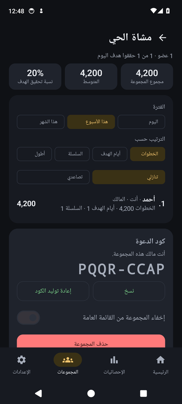 المجموعة من منظور المالك: كود الدعوة</td>
    <td align="center">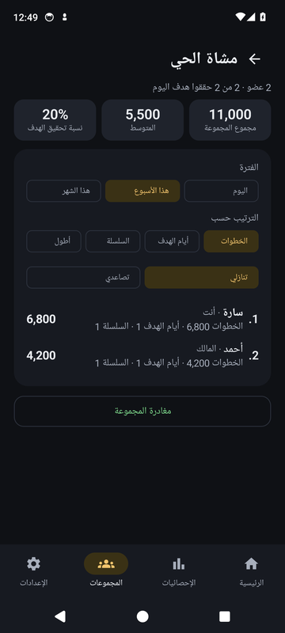 ترتيب الأعضاء مع الفلاتر</td>
  </tr>
</table>

### 3.2 ماذا يُرسل، وماذا لا

- الميزة **مطفأة افتراضياً**. لا يخرج من جوالك أي شيء حتى تضغط «تفعيل المجموعات» بنفسك.
- عند التفعيل يُرسل التطبيق إلى Firebase (خدمة من Google): اسمك المستعار، وخطوات اليوم وهذا الأسبوع وهذا الشهر، وعدد أيام تحقيق الهدف، وأطول جلسة مشي، وسلسلتك الحالية. لا شيء آخر، ولا يوجد إدخال يدوي للخطوات في أي مكان.
- هويتك **مجهولة**: لا بريد ولا كلمة مرور. تضيع عند حذف التطبيق أو مسح بياناته؛ حينها تنضم إلى مجموعاتك من جديد بكود الدعوة.
- غير الأعضاء لا يرون أسماء الأعضاء ولا كود الدعوة؛ تُفرض ذلك قواعد الأمان على الخادم لا واجهة التطبيق فقط.
- **حد معروف:** بلا خادم وسيط، مجموع كل مجموعة يُحسب من أرقام يرسلها كل جهاز بنفسه. مستخدم تقني يستطيع، عبر واجهة Firebase مباشرة لا عبر التطبيق، رؤية أرقام **مجهولة الهوية بلا أسماء**، ولا يستطيع أكثر من ذلك. كما أن مستخدماً تقنياً يستطيع التلاعب بأرقامه هو؛ الخادم يرفض فقط ما يتجاوز 60 ألف خطوة في اليوم.

### 3.3 الاستخدام

1. تبويب المجموعات ← اكتب اسماً مستعاراً ← **تفعيل المجموعات**.
2. **إنشاء مجموعة**: اسم + وصف. تفتح صفحة المجموعة وفيها كود الدعوة مع زر نسخ. أرسله لأصدقائك.
3. **انضمام بكود**: الصق الكود الذي وصلك.
4. أرقامك تُرسل عند فتح التبويب وكل ساعتين تقريباً في الخلفية (زر «تحديث» يرسلها فوراً).
5. **إيقاف المجموعات** في أسفل التبويب يوقف الإرسال في أي وقت.

### 3.4 لمن يبني نسخته الخاصة: إعداد Firebase

النسخة المنشورة في Releases مبنية بإعدادات مشروع Firebase الخاص بالمستودع. إن بنيت التطبيق بنفسك بلا هذه الإعدادات فسيعمل كل شيء ويظهر تبويب المجموعات رسالة «غير متاحة في هذه النسخة». لتشغيلها على مشروعك:

1. أنشئ مشروعاً في `console.firebase.google.com` (الخطة المجانية Spark تكفي).
2. **Firestore Database** ← أنشئ قاعدة بيانات (وضع الإنتاج) ← تبويب **Rules** ← الصق محتوى الملف `firebase/firestore.rules` كاملاً ← **Publish**.
3. **Authentication** ← Sign-in method ← فعّل **Anonymous**.
4. أضف تطبيق أندرويد باسم الحزمة `com.khatwa.app` ونزّل `google-services.json`. لا تضعه في المستودع العام؛ ضعه في `app/google-services.json` محلياً، أو في GitHub كسرّ باسم `KHATWA_GOOGLE_SERVICES_BASE64` (محتوى الملف مرمّزاً base64) فيستخدمه CI والنشر تلقائياً.
5. اختياري لكن مستحسن: **App Check** ← سجّل تطبيق أندرويد بمزوّد Play Integrity (يحتاج بصمة SHA-256 لمفتاح التوقيع؛ تجدها في مخرجات وظيفة CI «apksigner verify»). لا تفعّل «Enforce» قبل التأكد أن النسخة الموقّعة تعمل.

---

## 4. الأسئلة الشائعة

**القفل لا يعمل.** افتح التطبيق: إن ظهر تنبيه «القفل لا يعمل» فاضغط زره. غالباً السبب خدمة الإتاحة غير مفعّلة (انظر 1.4 للإعدادات المقيّدة) أو صلاحية العرض فوق التطبيقات. على سامسونج تأكد من Auto Blocker (1.2) والبطارية (1.6). أعد تشغيل الجوال بعد التفعيل إن لزم.

**الخطوات لا تُعدّ.** الإعدادات ← حالة الصلاحيات: تحقق من «حساس الخطوات» و«النشاط البدني» و«العدّاد يعمل». اضغط «تشغيل» لإعادة تشغيل العدّاد. تأكد من استثناء البطارية (1.6). تذكّر أن الجوال يجب أن يكون معك أثناء المشي. بعد إعادة تشغيل الجوال يعود العدّ تلقائياً ولا تضيع خطوات اليوم.

**اللابتوب يرفض كود القفل.** تأكد أنك نسخته من بطاقة القفل **النشط** في الرئيسية (لكل قفل كود جديد)، وأن اللابتوب مقترن بنفس الجوال (إن أعدت توليد كود الاقتران فأعد الاقتران).

**اللابتوب مقفول ولا أملك كود الفتح.** أكمل التحدي على الجوال أو استسلم فيه، فيظهر كود الفتح في الرئيسية (تبقى البطاقة حتى تخفيها). وإن ضاع الجوال: الطوارئ في شاشة قفل اللابتوب (يُسجَّل استسلاماً).

**فقدت كود الاقتران.** الجوال: الإعدادات ← قفل اللابتوب ← إعادة توليد، ثم في اللابتوب «إلغاء الاقتران» وأدخل الكود الجديد.

**كيف أحذف كل شيء؟** الجوال: الإعدادات ← النسخة الاحتياطية ← مسح كل البيانات، ثم احذف التطبيق. اللابتوب: الفقرة 2.7. المجموعات: غادر مجموعاتك (أو احذف التي تملكها) قبل مسح البيانات إن أردت إزالة أرقامك من الخادم.

**هل يستهلك البطارية؟** استهلاكه ضئيل: عدّاد الخطوات يعمل على معالج الحساسات منفصلاً، والتطبيق يقرأ قيمته فقط.

**ماذا يحدث عند منتصف الليل أو تغيير المنطقة الزمنية؟** يُغلق اليوم ويُفتح يوم جديد تلقائياً حتى لو كان التطبيق مغلقاً، والخطوات التي تُمشى بعد آخر قراءة قبل منتصف الليل تُحسب لليوم الجديد. تغيير المنطقة الزمنية لا يعيد فتح يوم مغلق أبداً.

---

## 5. للمطوّرين

- المستودع: `core/` وحدة Kotlin/JVM نقية (عدّ الخطوات مع الإقلاع ومنتصف الليل، الجلسات، الهدف التدرّجي، السلاسل، أكواد اللابتوب HMAC، ترتيب المجموعات) باختبارات تعمل بلا Android SDK؛ `app/` تطبيق أندرويد (Kotlin + Jetpack Compose + Room + WorkManager + Vico + Firebase)؛ `laptop-lock/` برنامج ويندوز (C#، .NET 8، WinForms)؛ `shared/hmac-vectors.json` قيم ثابتة يتحقق منها اختبار Kotlin واختبار C# معاً؛ `firebase/` قواعد أمان Firestore واختباراتها على المحاكي؛ `docs/screenshots/` لقطات هذا الملف، مأخوذة من محاكي CI.
- **النصوص** كلها في `app/src/main/java/com/khatwa/app/i18n/` (`Ar.kt` و`En.kt`)؛ لإضافة لغة أنشئ كائناً ثالثاً يطبّق `Strings`.
- **البناء عبر GitHub Actions** (`.github/workflows/ci.yml`): عند كل push على `main` وفروع `claude/**`. وظيفة Android: اختبارات الوحدة، APK debug وrelease، فحص خلوّ نسخة release من أدوات الاختبار، تشغيل محاكيات Firebase (Auth + Firestore) على الـ runner، محاكي أندرويد (API 34) يشغّل الاختبارات كلها بما فيها إنشاء مجموعة والانضمام إليها، ورفع الأدلة كـ artifact باسم `emulator-evidence`. وظيفة Firestore: اختبارات قواعد الأمان (`firebase/tests`) على المحاكي. وظيفة Windows: اختبارات C# وبناء exe واحد مستقل.
- **الأسرار** (Settings ← Secrets and variables ← Actions): التوقيع `KHATWA_KEYSTORE_BASE64` و`KHATWA_KEYSTORE_PASSWORD` و`KHATWA_KEY_ALIAS` و`KHATWA_KEY_PASSWORD` (بدونها يُوقَّع بمفتاح debug)، وإعدادات Firebase `KHATWA_GOOGLE_SERVICES_BASE64` (بدونها يُستخدم `app/google-services.placeholder.json` وتظهر المجموعات «غير متاحة»). لا keystore ولا `google-services.json` في المستودع.
- **النشر** (`.github/workflows/release.yml`): عند دفع وسم مثل `v0.2.0` تُنشأ صفحة Release مرفقاً بها `khatwa-<version>.apk` و`khatwa-laptop-lock-<version>.exe` (والسكربتان الاختياريان).
- **مصدر خطوات وهمي للاختبار**: نسخة debug فقط تحتوي `FakeStepSource` ومستقبِل adb (`app/src/debug`)، ويستبدل الحساس تلقائياً على المحاكي. نسخة release لا تحتوي أياً منهما ويُفحص ذلك في CI (`ci/verify-release.sh`).
- البناء محلياً: `./gradlew :core:test :app:assembleDebug` (يحتاج Android SDK وJDK 17)، `dotnet test laptop-lock/KhatwaLock.Tests` للجزء الخاص بويندوز، و`cd firebase && npm install && npm test` لقواعد Firestore (يحتاج Node 22 وJava).
- الرخصة: MIT.

