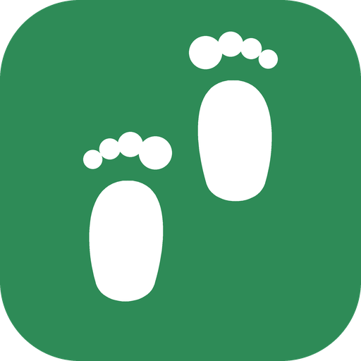
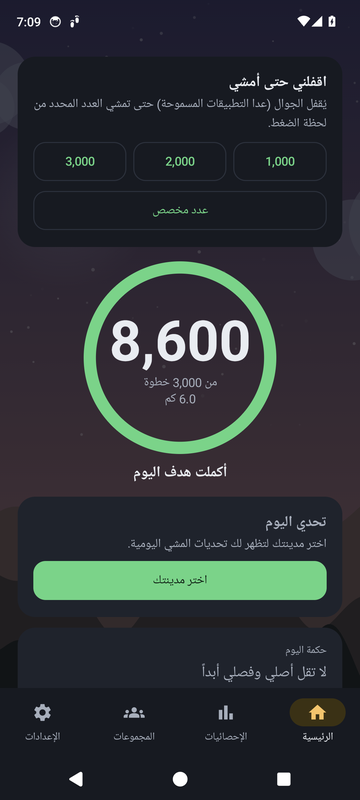
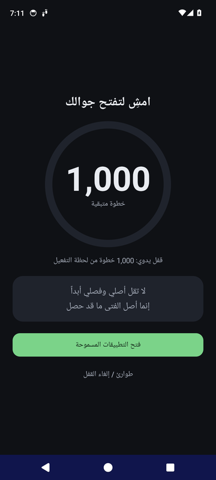
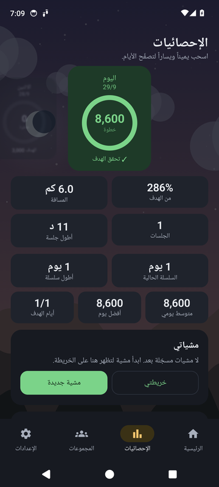
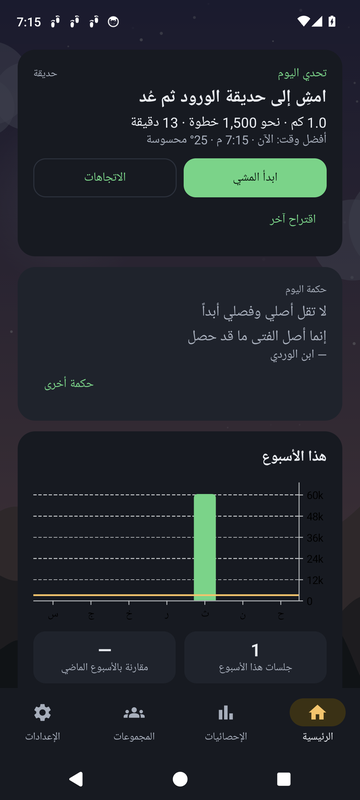
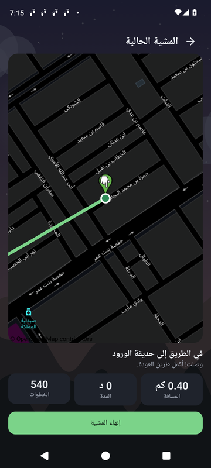
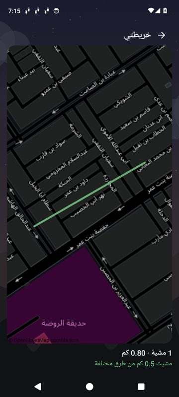
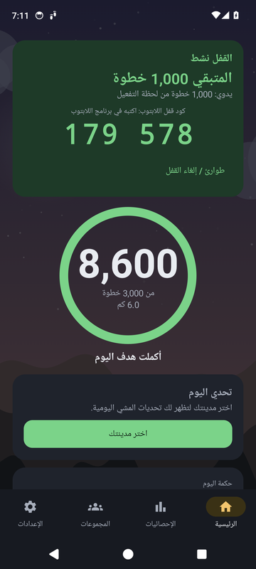
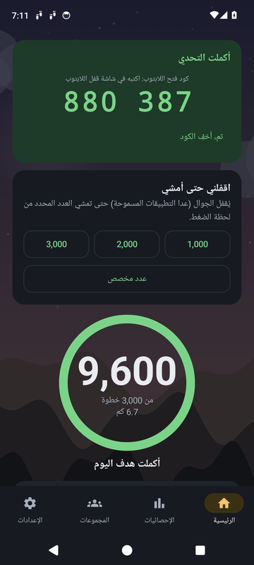
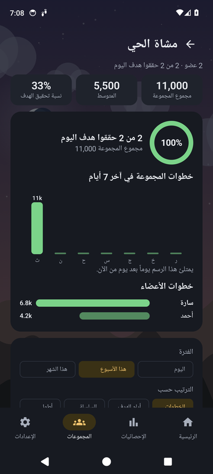

# khatwa (خطوة)

  
   
  <a href="docs/video/khatwa-explainer.mp4"><b>▶ شاهد الفيديو التعريفي (دقيقة واحدة)</b></a>

  
  &nbsp;
  
  &nbsp;
  

**English:** a free Android app (Arabic and English) that counts your steps and distance, can lock your phone (and your Windows laptop) until you walk, suggests a nearby place to walk every day at the best time for the weather and prayer times (Saudi cities), and draws your walks on a map. Download from **[Releases](https://github.com/Ahmad-Nayfeh/khatwa/releases/latest)**.

## ما هو «خطوة»؟

تطبيق مجاني يعدّ خطواتك ومسافتك كل يوم، ويقفل جوالك (ولابتوبك إن أردت) حتى تمشي عدداً محدداً من الخطوات، ويقترح عليك كل يوم مكاناً قريباً للمشي في أنسب وقت، ويرسم مشياتك على الخريطة. يعمل بلا إنترنت وبلا حساب (التحدي اليومي والخرائط تحتاج إنترنت). الحساب اختياري: يحفظ نسخة خاصة من بياناتك ويتيح المجموعات.

## التحميل

من صفحة **[Releases](https://github.com/Ahmad-Nayfeh/khatwa/releases/latest)**:

| الملف | لأي جهاز |
|---|---|
| `khatwa-….apk` | الجوال (أندرويد) |
| `khatwa-laptop-lock-….exe` | اللابتوب (ويندوز 10/11)، اختياري |

## تثبيت الجوال

1. نزّل ملف الـ APK على الجوال وافتحه. إن طُلب «السماح بالتثبيت من هذا المصدر» فاسمح به.
2. إن حجبه **Play Protect** اختر «التثبيت على أي حال».
3. افتح التطبيق واتبع شاشات الترحيب؛ تشرح كل صلاحية قبل طلبها. في شاشة «مدينتك» اختر مدينتك من القائمة أو اضغط «حدد مدينتي تلقائياً»، واكتب طولك لحساب المسافة.
4. ليعمل القفل فعّل **خدمة الإتاحة** و**العرض فوق التطبيقات**. التطبيق يرشدك خطوة بخطوة، وعلى أندرويد 13 فأعلى تكون ثلاث خطوات بالترتيب:
   1. الإتاحة ← التطبيقات المثبتة ← خطوة. تظهر رسالة «إعداد مقيّد»: اضغط «حسناً».
   2. معلومات التطبيق ← النقاط الثلاث أعلى الشاشة ← «السماح بالإعدادات المقيّدة» ← أكّد.
   3. ارجع إلى الإتاحة ← التطبيقات المثبتة ← خطوة، وفعّل الخدمة.
5. على سامسونج: إعدادات التطبيق ← البطارية ← **غير مقيّد**، حتى لا يتوقف العدّ.

## الاستخدام

- **الرئيسية:** خطوات اليوم والهدف، وأزرار القفل (1000 / 2000 / 3000 خطوة). يُفتح الجوال تلقائياً عندما تمشيها. الخلفية منظر متحرك يتغيّر مع وقت اليوم، وتحت الخطوات بيت من الشعر العربي مع اسم شاعره.
- **تحدي اليوم (في الرئيسية):** مكان قريب للمشي (حديقة، ممشى، مسجد، أو مول في أوقات الحر) بالمسافة التي تكمل هدفك، وأفضل وقت للخروج حسب الطقس ومواقيت الصلاة. اضغط «ابدأ المشي» فتُسجَّل مشيتك، ويُحتسب التحدي تلقائياً عند وصولك. «اقتراح آخر» يعطيك بديلاً. متاح لمدن السعودية فقط؛ خارجها يخبرك التطبيق أن الخدمة غير متاحة بعد في منطقتك.
- **مشياتي والخريطة (في الإحصائيات):** كل مشية مسجّلة بمسارها ومسافتها ومدتها، و«خريطتي» تعرض كل الطرق التي مشيتها وكم كيلومتراً من الشوارع المختلفة اكتشفت.
- **الإحصائيات:** اسحب شريط الأيام يميناً ويساراً لترى كل يوم (مع المسافة)، وتحته المخططات.
- **الإعدادات:** الهدف، المدينة والطول، القفل المجدول اليومي، التطبيقات المسموحة أثناء القفل، اللغة، والمظهر.
- **الحساب:** أول شاشة عند فتح التطبيق (ويمكن التخطي)، أو لاحقاً من الإعدادات ← الحساب. بلا حساب تبقى بياناتك على الجوال فقط، ونقلها مسؤوليتك عبر الإعدادات ← النسخة الاحتياطية. سجّل ببريدك وكلمة مرور فتُحفظ نسخة خاصة من بياناتك في حسابك تلقائياً كل يوم (لا يراها غيرك). إن حذفت التطبيق أو غيّرت جوالك، سجّل الدخول فتعود بياناتك.
- **الطوارئ:** زر في شاشة القفل: انتظار دقيقة ثم كتابة جملة، ويُسجَّل «استسلاماً».

## التحدي اليومي والخريطة

  
  &nbsp;
  
  &nbsp;
  

- **الخصوصية:** مساراتك تبقى على جوالك وفي نسختك الخاصة فقط، ولا تظهر للمجموعات أبداً. الطقس يُطلب لمركز مدينتك لا لموقعك. البحث عن الأماكن القريبة يرسل المنطقة التقريبية إلى خوادم OpenStreetMap مرة كل فترة، والنتائج تُحفظ على الجوال.
- **صلاحية الموقع:** تُطلب عند أول استخدام فقط (مشية، أو «حدد مدينتي»)، وأثناء استخدام التطبيق فقط.
- **المصادر:** الخرائط والأماكن © OpenStreetMap contributors، الطقس Open-Meteo.com، قائمة المدن GeoNames.

## قفل اللابتوب (اختياري)

  
  &nbsp;
  

1. **مرة واحدة:** في الجوال: الإعدادات ← قفل اللابتوب ← «توليد كود الاقتران» (8 أرقام). شغّل برنامج اللابتوب واكتب الأرقام.
2. **للقفل:** اقفل جوالك، فيظهر في الرئيسية كود من 6 أرقام. اكتبه في برنامج اللابتوب فيُقفل فوراً.
3. **للفتح:** عندما تكمل المشي يظهر كود فتح من 6 أرقام. اكتبه في شاشة قفل اللابتوب فيُفتح.

لا شبكة ولا بلوتوث. إن ظهر تحذير Windows SmartScreen عند أول تشغيل: «مزيد من المعلومات» ← «التشغيل على أي حال».

## المجموعات (اختياري)

من تبويب **المجموعات** (تحتاج حساباً): أنشئ مجموعة وشارك كود الدعوة مع أصدقائك، وتنافسوا على الخطوات. الأرقام تتحدّث أثناء المشي، وفي صفحة المجموعة رسوم: كم عضواً حقق هدف اليوم، ومجموع آخر 7 أيام، وخطوات كل عضو. الميزة مطفأة حتى تفعّلها، وعندها تُرسل اسمك المستعار وأرقام خطواتك فقط؛ بريدك للدخول فقط ولا يراه أحد من الأعضاء. نسيت كلمة المرور؟ زر «نسيت كلمة المرور؟» يرسل رابطاً إلى بريدك.

## أسئلة سريعة

- **القفل لا يعمل؟** في الرئيسية، تحت تنبيه «القفل لا يعمل»، اضغط «كيف أفعّله؟» واتبع الخطوات الثلاث. أو راجع الإعدادات ← حالة الصلاحيات.
- **الخطوات لا تُعدّ؟** الجوال يجب أن يكون معك أثناء المشي. راجع الإعدادات ← حالة الصلاحيات، وقيود البطارية على سامسونج.
- **اللابتوب يرفض الكود؟** اكتب الكود الظاهر الآن في الرئيسية (لكل قفل كود جديد). إن أعدت توليد كود الاقتران فأعد الاقتران في اللابتوب.
- **نقلت إلى جوال جديد؟** إن كان لديك حساب: سجّل الدخول فتعود بياناتك ومجموعاتك. بلا حساب: الإعدادات ← النسخة الاحتياطية ← تصدير، ثم استيراد في الجوال الجديد.

---

مفتوح المصدر برخصة MIT. للمطوّرين: [docs/DEVELOPERS.md](docs/DEVELOPERS.md).

